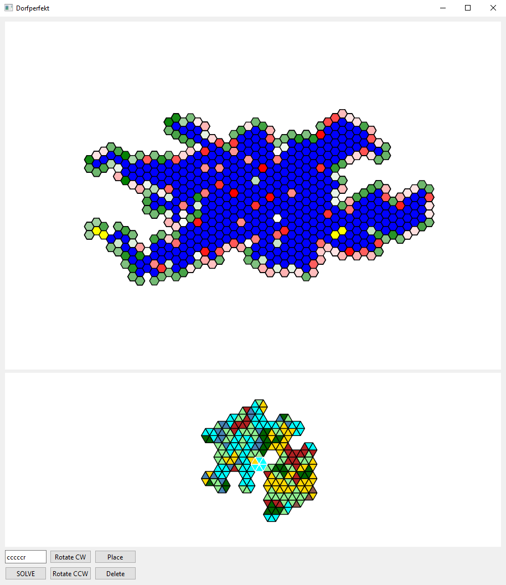
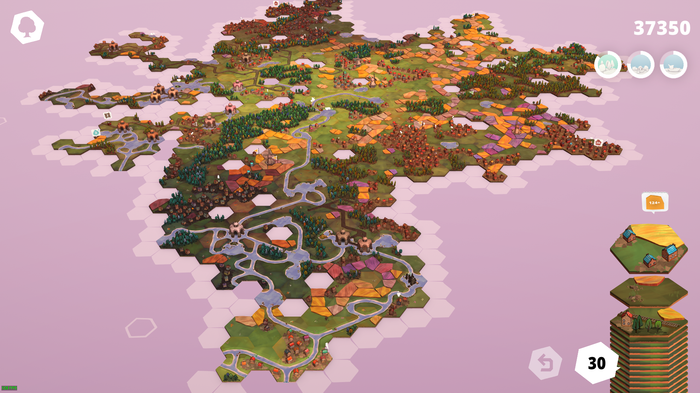
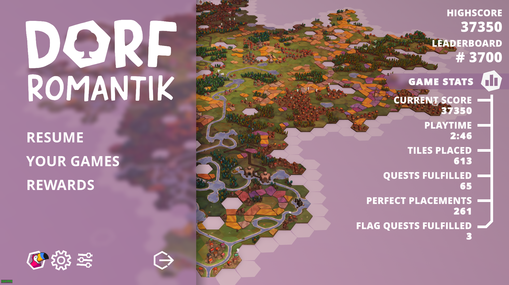

# Dorfperfekt

Tile placement suggestions for the game Dorfromantik. With an emphasis on perfect tile placement, this software tool enables the player to play indefinitely (and achieve a massive score while doing so).





## How It Works

The player inputs a six-character text string representing the next tile to be placed. Each valid placement is then evaluated by the solver according to the following (in order of precedence):

1. How many tiles would be ruined by this placement? Less is better.
2. Of the tiles encountered so far, how many would alternatively fit perfectly at this position? Less is better.
3. Assuming this placement is made, consider each adjacent open position. Of the tiles encountered so far, how many would fit perfectly at that adjacent position? Take the minimum of all adjacent open positions. More is better.

The latter two computations will take a significant amount of time as the game progresses and more unique tiles are encountered. A threshold is set by the user so that the solver can be instructed to ignore rarer tiles.

## Using the Application

Dorfperfekt displays an overall map of the board. Dark gray tiles are non-ruined placements and light gray tiles are ruined placements. After entering a tile definition string and pressing the solve button, the progress bar will increment and pressing the refresh button will overlay a heatmap of the possible moves onto the board. Green is better, red is worse, and white is neutral (or not yet evaluated).

Positions on the map can be clicked on. By clicking on a proposed position for your next placement, a view of the local terrain is generated. The tile to be placed is given a proposed best rotation but the user may use the rotate button to select an alternate rotation.

Existing tiles may also be clicked on such that they may be deleted or set as the origin to recenter the map of the board.

## Tile Definitions

A tile is defined by a six-character text string where each character represents the edge terrains in **clockwise** order. If all edges of the tile are the same a single character may be used instead. Tile characters are deliberatly selected to all be accessible from the left hand.

- Grass, "g"
- Forest, "f"
- Ranch, "r" (ie. wheat/lavender fields)
- Dwelling, "d" (ie. houses)
- Water, "w" (ie. rivers)
- Station, "s"
- Train, "t"
- Coast, "c" (ie. lakes)

## Installation

From the command line, install with `pip install dorfperfekt`. The application can then be run from the command line with `dorfperfekt`.

## Development

Setting up the software development environment is easy.

```bash
poetry install
poetry run pre-commit install
```
